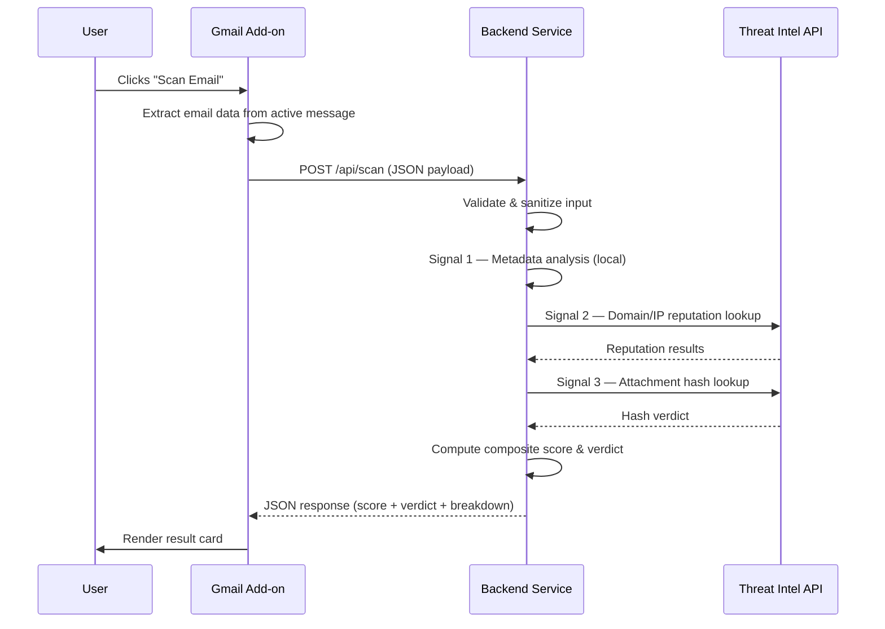

# Upwind Malicious Email Scorer — MVP Architecture

> **Status:** Design Phase · v0.1.0  
> **Last Updated:** 2026-05-02

---

## Table of Contents

1. [Architecture Overview](#1-architecture-overview)
2. [Data Flow & Trigger](#2-data-flow--trigger)
3. [Core Signals (The MVP)](#3-core-signals-the-mvp)
4. [Scoring & Verdict](#4-scoring--verdict)

---

## 1. Architecture Overview

The system follows a strict **client–server separation of concerns**, dividing responsibilities between a thin frontend layer and a security-hardened backend service.

### Frontend — Gmail Add-on (Google Workspace Add-on API)

The frontend is a **minimal Gmail Add-on** built on the Google Workspace Add-on framework. Its responsibilities are intentionally narrow:

- **Render a "Scan" action button** within the Gmail message view via a Card-based UI.
- **Extract raw email data** (body, headers, attachments) from the currently open message using the Gmail-specific event object.
- **Transmit a structured JSON payload** to the backend over HTTPS.
- **Display the scan result** (score + verdict + signal breakdown) returned by the backend.

> [!IMPORTANT]
> The frontend performs **zero** analysis or scoring logic. It is a pure I/O surface — collect, send, render. All business logic, validation, and external API calls are handled exclusively by the backend.

### Backend — Node.js / TypeScript Service

The backend is a **Node.js/TypeScript HTTP service** responsible for:

| Responsibility | Details |
|---|---|
| **Input Validation** | Sanitize and validate every field of the incoming JSON payload before processing. All input is treated as **untrusted**. |
| **Signal Extraction** | Run the three core analysis signals (metadata, enrichment, attachment) against the validated email data. |
| **API Orchestration** | Coordinate calls to external Threat Intelligence APIs (e.g., VirusTotal) with proper rate-limiting, timeouts, and error handling. |
| **Scoring Engine** | Combine individual signal outputs into a single composite score and human-readable verdict. |
| **Response Formatting** | Return a structured JSON response containing the score, verdict, and per-signal explanations. |

> [!CAUTION]
> The backend **never** saves attachments to disk or executes any received content. Attachments are processed exclusively as in-memory byte streams for hashing.

---

### Security Architecture & Trust Boundaries

To enforce a "Zero Trust" approach, the backend implements strict security gates before any payload reaches the scoring engine:

- **Static API Key Authentication:** The service is protected by API Key authentication (`x-api-key` or `Authorization` header). This serves as a lightweight, server-to-server security measure for the MVP.
  - *Trade-offs:* While simple to implement and manage for a single-client MVP, static keys lack the granular scoping, automatic rotation, and identity attribution provided by dynamic secrets or IAM-based authentication (e.g., OAuth2/JWT).
- **Strict Input Validation:** All incoming requests must pass through a strict schema-validation middleware. The payload (`req.body`) is parsed to ensure it adheres precisely to the core schema (e.g., `body` as a string, `headers` with a `from` field, optional `attachments` array). Any deviation results in an immediate `400 Bad Request`, preventing downstream crashes, injection attacks, or unexpected behavior in the scoring engine.

---

## 2. Data Flow & Trigger

### Trigger Model

Scanning is **manual** — the user explicitly clicks a **"Scan Email"** button rendered by the Gmail Add-on. There is no background polling, automatic scanning, or inbox-wide batch processing in the MVP.

### Sequence



### Request Payload Contract

The Add-on sends the following JSON structure to `POST /api/scan`:

```jsonc
{
  // The full raw body of the email (plain text and/or HTML).
  "body": "<string>",

  // Parsed email headers relevant for authentication & origin analysis.
  "headers": {
    "from": "sender@example.com",
    "replyTo": "reply@example.com",       // May differ from 'from' (spoofing signal)
    "subject": "Urgent: Verify your account",
    "receivedSpf": "pass",                // SPF validation result
    "dkimSignature": "<raw DKIM header>", // DKIM signature header value
    "authenticationResults": "<raw auth-results header>",
    "receivedChain": [                    // Ordered list of 'Received' headers
      "from mail-server.example.com (192.0.2.1) ..."
    ]
  },

  // Array of attachment objects. Each attachment is Base64-encoded.
  "attachments": [
    {
      "filename": "invoice.pdf",
      "mimeType": "application/pdf",
      "size": 204800,                     // Size in bytes
      "contentBase64": "<Base64-encoded content>"
    }
  ]
}
```

### Response Payload Contract

```jsonc
{
  "score": 78,                            // Composite risk score (0–100)
  "verdict": "High Risk",                 // Human-readable label
  "signals": [
    {
      "name": "Metadata & Spoofing",
      "score": 85,
      "details": "SPF check failed. Subject contains urgency pattern."
    },
    {
      "name": "Sender Reputation",
      "score": 70,
      "details": "Domain example.com flagged in 2 threat feeds."
    },
    {
      "name": "Attachment Analysis",
      "score": 80,
      "details": "SHA-256 hash matched known malware signature (VirusTotal: 12/70)."
    }
  ]
}
```

---

## 3. Core Signals (The MVP)

The backend evaluates each email against **three independent signals**. Each signal produces its own sub-score (0–100) and a human-readable explanation.

---

### Signal 1 — Metadata & Spoofing Detection (Local)

> **Type:** Local analysis · No external API calls  
> **Latency:** < 10 ms

This signal performs two categories of checks entirely within the backend, using only the data present in the request payload.

#### 1a. Authentication Header Analysis

| Check | Logic |
|---|---|
| **SPF Validation** | Parse the `Received-SPF` / `Authentication-Results` header. Flag if result is `fail`, `softfail`, or `none`. |
| **DKIM Verification** | Parse the `DKIM-Signature` and `Authentication-Results` headers. Flag if DKIM result is `fail` or absent. |
| **From ↔ Reply-To Mismatch** | Compare the `From` and `Reply-To` addresses. A mismatch (different domain) is a strong spoofing indicator. |

#### 1b. Body & Subject Pattern Matching

Apply regex-based and keyword-based heuristics to detect common phishing and social engineering patterns:

- **Urgency Language:** "immediately", "urgent", "act now", "your account will be suspended"
- **Credential Harvesting:** "verify your password", "confirm your identity", "click here to login"
- **Impersonation Cues:** Mentions of known brands coupled with mismatched sender domains
- **Suspicious URLs:** Presence of URL-shorteners, IP-based URLs, or homoglyph domains in the body

> [!NOTE]
> Pattern matching is intentionally **rule-based** for the MVP. Machine-learning classifiers are a planned enhancement for future iterations.

---

### Signal 2 — Dynamic Sender Enrichment (External API)

> **Type:** External API call  
> **Latency:** 200–1500 ms (network-dependent)

This signal enriches the email metadata by querying external **Threat Intelligence (TI)** APIs to assess the reputation of the sender's domain and originating IP address.

#### Extraction

1. **Sender Domain** — Extracted from the `From` header (e.g., `example.com`).
2. **Originating IP** — Extracted from the first hop in the `Received` header chain.

#### Enrichment Query

The backend queries one or more TI providers (e.g., VirusTotal, AbuseIPDB) with the extracted domain and/or IP. The response typically includes:

- Whether the domain/IP appears on known **blocklists** or threat feeds.
- Historical **abuse reports** and their recency.
- Domain **age** and registration metadata (newly registered domains are higher risk).
- **Reputation score** from the provider's own models.

#### Error Handling

| Scenario | Behavior |
|---|---|
| API timeout / rate limit | Signal returns a **neutral score** (50) and flags as `"inconclusive"` in the details. |
| API key missing / invalid | Signal is **skipped** entirely; composite score adjusts weights accordingly. |
| Domain/IP not found | Treated as **no known threat** — low sub-score contribution. |

---

### Signal 3 — Safe Attachment Analysis (Stream + Hash Lookup)

> **Type:** In-memory processing + External API call  
> **Latency:** Variable (depends on attachment size + API response)

This signal analyzes email attachments **without executing, rendering, or persisting them** — a critical security constraint.

#### Processing Pipeline

```
Base64 payload ──▶ Decode to byte stream (in-memory)
                         │
                         ▼
              Compute SHA-256 hash
                         │
                         ▼
        Query Threat Intelligence API
          (e.g., VirusTotal /file/report)
                         │
                         ▼
             Return detection ratio
              & threat classification
```

#### Step-by-Step

1. **Decode:** The Base64-encoded attachment content from the request payload is decoded into a raw byte buffer in memory.
2. **Hash:** A **SHA-256** cryptographic hash is computed over the byte buffer. This produces a unique fingerprint of the file without inspecting its contents.
3. **Lookup:** The hash is submitted to a Threat Intelligence API (e.g., VirusTotal's `GET /files/{hash}` endpoint) to check if the file has been previously analyzed and flagged.
4. **Interpret:** The API response (e.g., detection ratio `12/70`) is translated into a sub-score.

> [!WARNING]
> The backend **must not** write the decoded bytes to the filesystem, execute the file, or pass it to any local sandboxing tool. All processing is strictly **in-memory and ephemeral**. The byte buffer is discarded immediately after hashing.

#### Per-Attachment Scoring

If an email contains multiple attachments, each is hashed and looked up independently. The Signal 3 sub-score is the **maximum** risk score across all attachments (worst-case model).

---

## 4. Scoring & Verdict

### Composite Score Calculation

The three signal sub-scores are combined into a single **composite risk score** on a 0–100 scale using a **weighted average**:

| Signal | Weight | Rationale |
|---|---|---|
| Signal 1 — Metadata & Spoofing | **0.35** | Spoofed authentication is a strong primary indicator. |
| Signal 2 — Sender Reputation | **0.30** | External reputation provides valuable corroboration. |
| Signal 3 — Attachment Analysis | **0.35** | Known-malware attachments are a critical, high-confidence threat. |

```
compositeScore = (signal1.score × 0.35) + (signal2.score × 0.30) + (signal3.score × 0.35)
```

> [!NOTE]
> Weights are configurable and will be tuned based on real-world feedback. If a signal is unavailable (e.g., no attachments → Signal 3 is N/A), its weight is redistributed proportionally across the remaining signals.

### Verdict Mapping

The composite score maps to a human-readable verdict:

| Score Range | Verdict | Visual Indicator |
|---|---|---|
| **0 – 29** | ✅ Low Risk | Green |
| **30 – 59** | ⚠️ Medium Risk | Amber / Yellow |
| **60 – 84** | 🔶 High Risk | Orange |
| **85 – 100** | 🔴 Critical Risk | Red |

### Explainability

Every response includes a **per-signal breakdown** (see [Response Payload](#response-payload-contract)), ensuring the user understands *why* the email received its score. This is essential for trust and actionability — a black-box number is insufficient.

---

> **Next Steps:** With this architecture ratified, the implementation phase will scaffold the backend service, define TypeScript interfaces matching these contracts, and wire up the signal pipeline incrementally.
